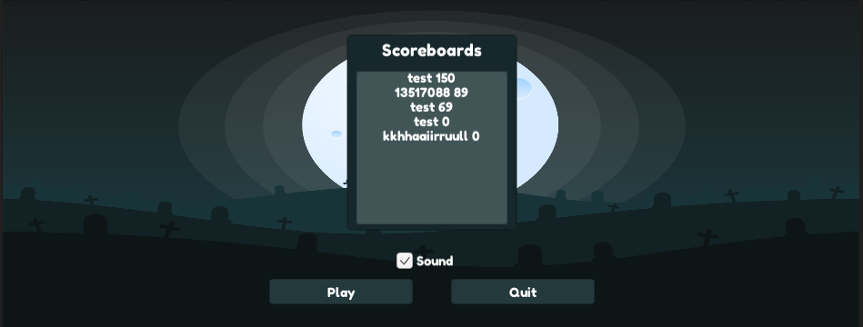
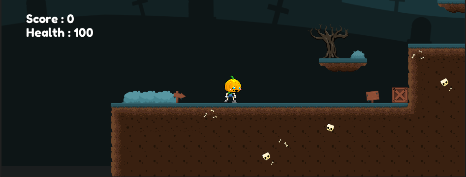
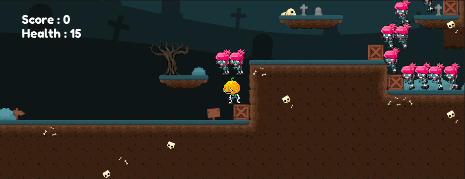
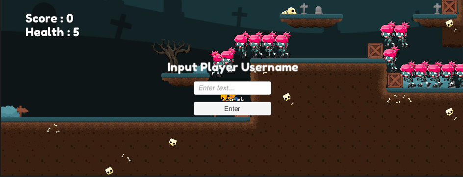

# IF3210-2020-Unity-13517088

### Deskipsi Aplikasi
Aplikasi yang dibuat merupakan game 2D platformer dimana pemain dapat mengendalikan sebuah karakter 2D dengan bergerak dan menembak musuh2nya

### Cara kerja
Cara kerja game yang dibuat adalah:
* pemain menggerakkan karakter dengan WAD dimana W digunakan untuk lompat, sedangkan A dan D digunakan untuk bergerak kiri dan kana
* pemain menembak musuh dengan menekan tombol kanan mouse
* permainan akan selesai ketika pemain sudah mati atau nyawa pemain 0
* score dari tiap permainan disimpan di sebuah server
* score dari tiap permainan akan ditampilkan saat game pertama dimulai, di bagian scoreboards-nya
* pemain bisa check atau uncheck sound pada layar mainm menu

### Library yang digunakan
### Screenshot aplikasi

